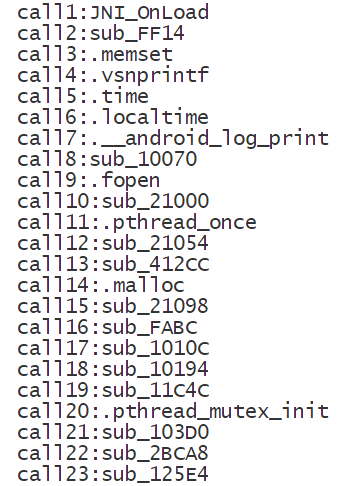

# stalker_trace_so

一个IDA插件，利用frida-stalker在加载so时打印出所有函数调用，解决frida-trace无法在so加载时trace的问题

# 使用

1. 将`stalker_trace_so.py`复制到`[IDA安装目录]\plugins`

2. 在IDA中选择`Edit->Plugins->stalker_trace_so`，将会在so所在的目录下自动生成`trace_xxx.js`

3. frida运行脚本
   ```shell
   frida -U -l trace_xxx.js -f [package name]
   ```

   示例输出：

   